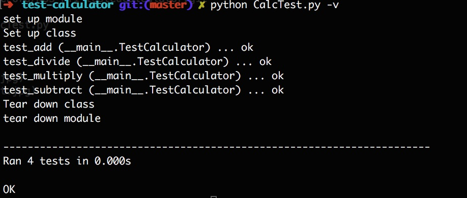

# Python Calculator Testing Exercise

**Author**: Megan Ford July 2016 


Created as student exercises as part of Nashville Software School's Back End Bootcamp curriculum. Please see below for fulfilled requirements: this exercise is not meant to be a finished production app or indication of current skills, but rather a demonstration of skills learned and utilized at the time of creation.


## Instructions


NSS Back-End Milestone 1 (Foundations) Exercise 8: 


[Requirements For Project](https://github.com/nashville-software-school/python-milestones/blob/master/01-foundations/exercises/FND_CALCULATOR.md)


## Install


``` 
git clone https://github.com/MeganCFord/NSS-PY1-testedCalculator.git
cd test-calculator
python calculator.py || python CalcTest.py
```





## License 


[MIT license](LICENSE.md)

